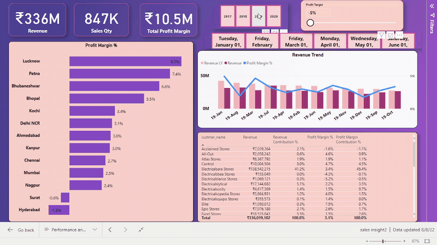
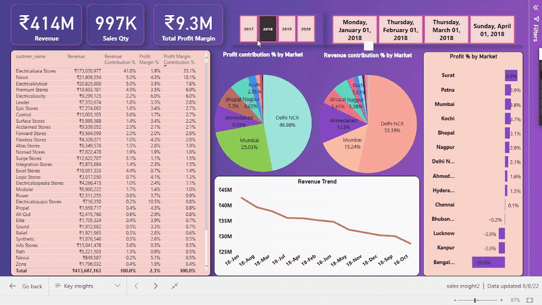
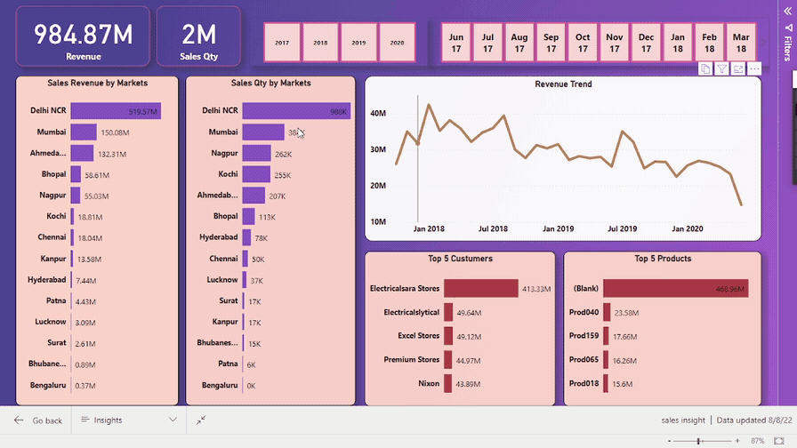
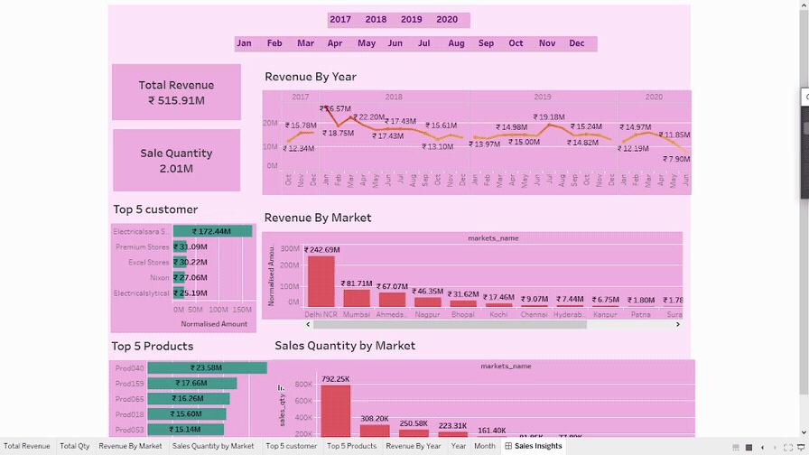

## Sales Insights Data Analysis Project
## Table of Content
  * [Demo](#demo)
  * [Problem Statement](#problem-statement)
  * [Approach](#approach)
  * [Technologies Used](#technologies-used)
  * [Data Analysis Using SQL](#Data-Analysis-Using-SQL)
  * [Bugs & Logs](#bugs--logs)
  * [Contributors](#contributors)

## Demo
Tableau: [https://public.tableau.com/views/Salesinsights_16600190079160/SalesInsights?:language=en-US&:display_count=n&:origin=viz_share_link](https://public.tableau.com/views/Salesinsights_16600190079160/SalesInsights?:language=en-US&:display_count=n&:origin=viz_share_link)

PowerBI Dashboard 1: [https://app.powerbi.com/links/tS7EZEtBys?ctid=6d2f8f03-c411-4299-9bbd-870e5b287ccd&pbi_source=linkShare](https://app.powerbi.com/links/tS7EZEtBys?ctid=6d2f8f03-c411-4299-9bbd-870e5b287ccd&pbi_source=linkShare)

PowerBI Dashboard 2: [https://app.powerbi.com/links/r3kuNDYWfR?ctid=6d2f8f03-c411-4299-9bbd-870e5b287ccd&pbi_source=linkShare](https://app.powerbi.com/links/r3kuNDYWfR?ctid=6d2f8f03-c411-4299-9bbd-870e5b287ccd&pbi_source=linkShare)

## Screenshots

## Problem Statement

## Approach
Downloading Dataset from company

Imported the dataset in my local mysql server

Data analysis using my sql to get overview of data 

Data analysis using PowerBi : ETL, Dax queries, Realtime Dashboard

Data analysis using Tableau : ETL, Realtime Dashboard

Published both report/dashboards on web for easy access to public.

## Technologies Used

SQl (MySQL)
Tableau
PowerBi
Dax 

### Instructions to setup mysql on your local computer

1. SQL database dump is in db_dump.sql file above. Download `db_dump.sql` file to your local computer and import it to MySQL. Also there is Advanced version of file for more insights.

## Data Analysis Using SQL

1. Show all customer records

    `SELECT * FROM customers;`

1. Show total number of customers

    `SELECT count(*) FROM customers;`

1. Show transactions for Chennai market (market code for chennai is Mark001

    `SELECT * FROM transactions where market_code='Mark001';`

1. Show distrinct product codes that were sold in chennai

    `SELECT distinct product_code FROM transactions where market_code='Mark001';`

1. Show transactions where currency is US dollars

    `SELECT * from transactions where currency="USD"`

1. Show transactions in 2020 join by date table

    `SELECT transactions.*, date.* FROM transactions INNER JOIN date ON transactions.order_date=date.date where date.year=2020;`

1. Show total revenue in year 2020,

    `SELECT SUM(transactions.sales_amount) FROM transactions INNER JOIN date ON transactions.order_date=date.date where date.year=2020 and transactions.currency="INR\r" or transactions.currency="USD\r";`
	
1. Show total revenue in year 2020, January Month,

    `SELECT SUM(transactions.sales_amount) FROM transactions INNER JOIN date ON transactions.order_date=date.date where date.year=2020 and and date.month_name="January" and (transactions.currency="INR\r" or transactions.currency="USD\r");`

1. Show total revenue in year 2020 in Chennai

    `SELECT SUM(transactions.sales_amount) FROM transactions INNER JOIN date ON transactions.order_date=date.date where date.year=2020
    and transactions.market_code="Mark001";`

## Bugs & Logs

1. If you find a bug, kindly open an issue and it will be addressed as early as possible. [Open](https://github.com/hrishikeshkini/sales-insight-using-sql-tableau-powerbi/issues)

## Contributors
  [Hrishikesh Kini](https://github.com/hrishikeshkini)

